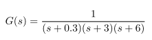

# EE-CRS-Lab1
Opgave:
Een proces heeft de volgende transfertfunctie.

  

                                         
Bepaal:

1. Geef van dit systeem de polen en nullen. Wat is de eindwaarde van het OL stapantwoord. Plot dit. Is dit systeem OL—stabiel?
2. Bepaal Via de bode plot de maximale waarde voor een proportionele versterking zodat een marginaal stabiele regelkring verwezenlijkt wordt.
3. Controleer deze waarde Via een Nyquist diagram voor deze K1) waarde.
4. Ontwerp een PI regelaar met een fasemarge van 45 graden. Wat 2in de settling en rise tijden?
5. Ontwerp een PID regelaar voor dit systeem met dezelfde fasemarge. Vergelijk met de PI regelaar en selecteer een van beide. Motiveer je keuze.
