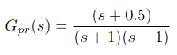

# EE-CRS-Lab2
Opgave:
Een proces heeft de volgende transfertfunctie.

  

                                         
Bepaal:

1.  Geef van dit proces de polen en nullen.  Wat is de eindwaarde van het OL stapantwoord. Is dit systeem OL-stabiel?
2.   Stel dat een P-regelaar het proces zou controleren.  Bepaal daarvoor voor welke verster-kingsfactor Kp het systeem closed loop stabiel is dmv een poolbaan diagram.  Verifieer met een Nyquist diagram en pas het Nyquist criterium toe.
3.  Ontwerp twee regelaars:  Een P en een PI-regelaar die dit systeem stabiel maken en de eindwaarde van het CL-stapantwoord in de buurt van 1 brengt.
4.  Vergelijk P- en PI regelaar.  Plot de stapantwoorden:  Wat zijn de settling en rise tijdenen het doorschot?  Plot het Bode diagram van het CL-systeem:  Wat is de bandbreedte?
5. Motiveer je keuze voor de ’beste’ regelaar
